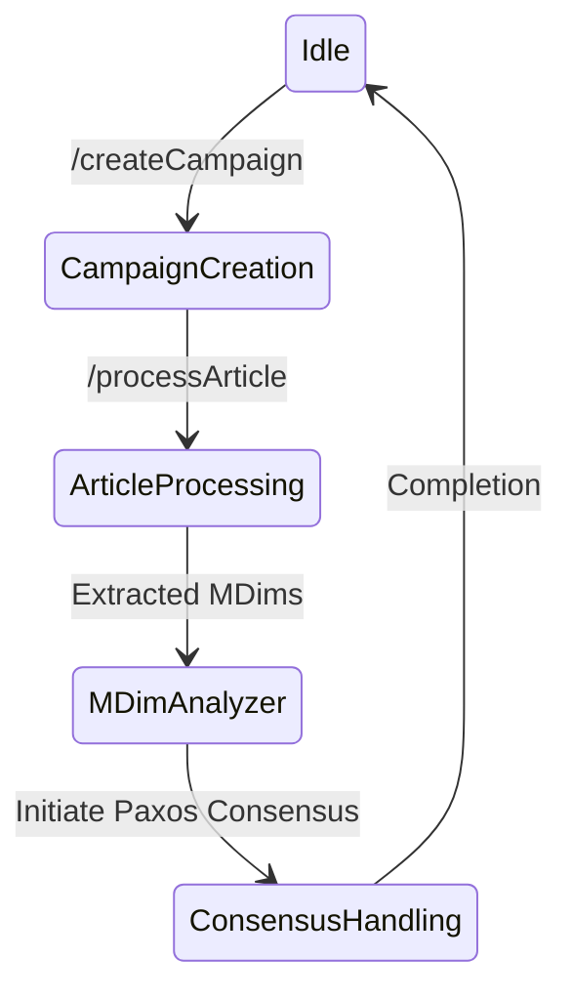
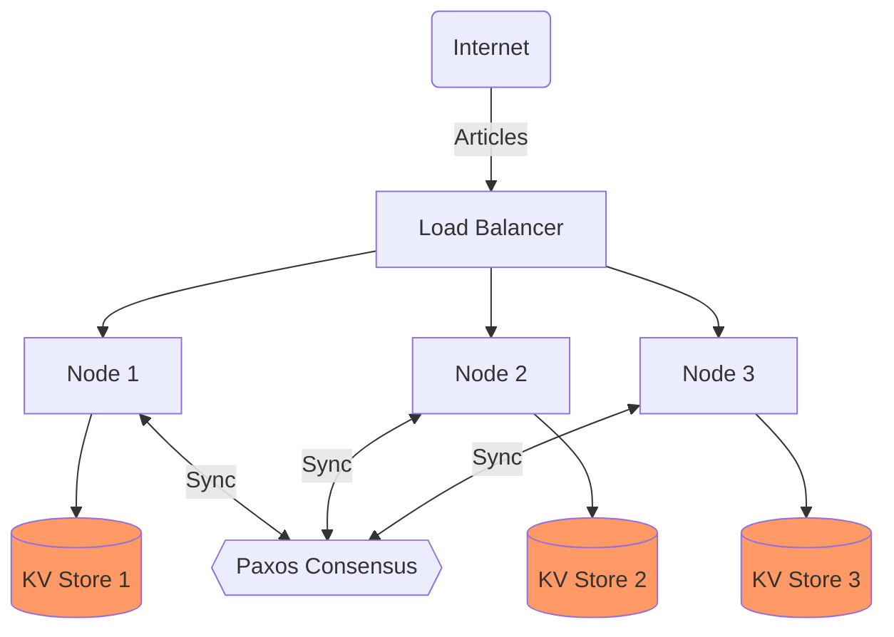
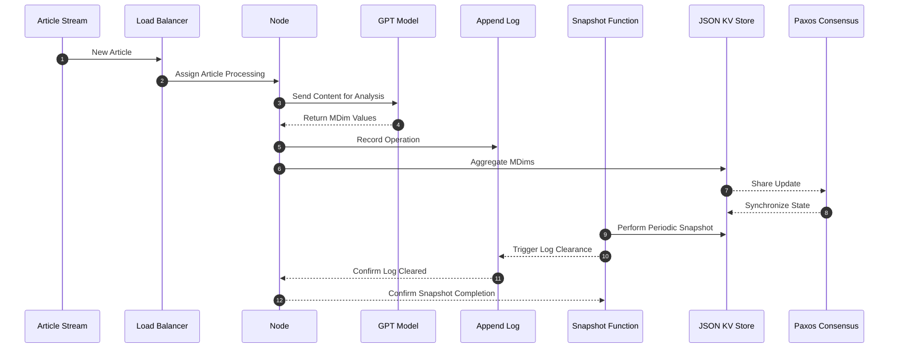

# Distributed Semantic Analysis/Monitoring System Design Document

## Table of Contents

- [Introduction](#introduction)
- [System Architecture](#system-architecture)
- [Node Design](#node-design)
- [Networking and Communication](#networking-and-communication)
- [Load Balancing Strategy](#load-balancing-strategy)
- [Storage and Log Management](#storage-and-log-management)
- [Metadata Extraction](#metadata-extraction)
- [API Endpoints](#api-endpoints)
- [Performance Benchmarking](#performance-benchmarking)
- [Future Considerations](#future-considerations)
- [Story Point Estimation](#story-point-estimation)

## Introduction

The purpose of this document is to outline the design for a Distributed Semantic Analysis/Monitoring system, which analyzes public sentiment across various dimensions in articles related to specific topics over time. The system aims to demonstrate improved processing speed and efficiency by using a distributed approach compared to a synchronous single-node system.

## Identification of Problem

The objective of this project is to develop a Distributed Semantic Analysis/Monitoring System that analyzes public sentiment across various dimensions in articles related to specific topics over time. The system aims to demonstrate improved processing speed and efficiency by using a distributed approach compared to a synchronous single-node system.

## Main Components
| Components                         | Description                                                                                                       |
|------------------------------------|-------------------------------------------------------------------------------------------------------------------|
| Node                               | Responsible for creating campaigns, processing articles, and handling consensus through the Paxos mechanism.       Maintains a JSON KV Store for state data.                                                                         |
| Paxos Consensus Mechanism          | Orchestrates the synchronization of updates across nodes to ensure a consistent view of the JSON KV Store.        Involves initiation, proposal phase, prepare phase, promise phase, acceptance condition, accept phase, and commitment phase. |
| Load Balancer                      | Distributes incoming article processing requests evenly across available nodes using a round-robin algorithm.     |
| JSON KV Store                      | Stores node state data, including campaign information and processed MDims.                                       Maintains an append-only log file for operations, periodically compressed and snapshot for updates.                 |
| Metadata Extraction                | Full implementation involves analyzing article content to obtain sentiment scores relevant to each MDim.             |
| HTTP/REST Communication            | Nodes communicate using HTTP/REST for simplicity and ease of implementation.                                       Each node has a RESTful API supporting endpoints for creating campaigns, processing articles, and reading MDims.  |

## Guarantees to Users

1. Updates to MDims for sentiment analysis are consistent across nodes, providing a unified view.
2. MDims are stored in an append-only mode, maintaining a historical record of sentiment changes.
3. Redundant updates are avoided; the system compares MDims to ensure the sentiment of an article is updated only once for a specific date.

## Proposed Solution
### State 1: Idle

**Description:**
- **Purpose:** The initial state where the system is ready to receive requests and initiates the process for creating a new campaign.
- **Transitions:**
  - **Campaign Creation Request:**
    - **Conditions:** Triggered by an incoming request to create a new campaign (POST /createCampaign).

### State 2: Campaign Creation

**Description:**
- **Purpose:** This state is entered when the system receives a valid request to create a new campaign. It involves generating a unique campaignId and initializing the campaign in the JSON KV Store.
- **Actions:**
  - **Generate Campaign ID:**
    - Generate a unique identifier (campaignId) for the new campaign.
  - **Initialize Campaign:**
    - Set up the new campaign in the JSON KV Store with default MDims.
- **Transitions:**
  - **Article Processing Request:**
    - **Conditions:** Triggered by an incoming request to process an article (POST /processArticle).

### State 3: Article Processing

**Description:**
- **Purpose:** This state is entered when the system receives a valid request to process an article. It involves using the OPENAI API to extract the MDims from the article content.
- **Actions:**
  - Initiates connection to the OPENAI API.
  - Extract MDims from the article content.
- **Transitions:**
  - **Transition to the "MDim Analyzer" state:**
    - **Conditions:** Triggered by an incoming request to process the MDims.

### State 4: MDim Analyzer

**Description:**
- **Purpose:** This state is entered when the system initiates the retrieval of MDims for a specified campaign and date. The purpose of this state is initiating the Paxos consensus mechanism and also performs the aggregation step.
- **Actions:**
  - Retrieve the current MDims and the count of processed values for the specified date.
  - Aggregate the new MDims using a defined formula.
  - Initiate the Paxos consensus mechanism to synchronize the updated MDims across nodes.
  - Initiate the Paxos consensus mechanism for subsequent updates.
- **Transitions:**
  - **Consensus Handling Initiation:**
    - **Conditions:** Triggered by an incoming request to initiate the Paxos consensus process.

### State 5: Consensus Handling

**Description:**
- **Purpose:** This state is entered when the system initiates the Paxos consensus mechanism to synchronize updates across nodes.
- **Actions:**
  - Execute the Paxos consensus mechanism to synchronize updates across nodes.
- **Transitions:**
  - **Return to Idle (Completion):**
    - **Conditions:** Occurs after successful consensus and completion of the consensus process. The system is ready to receive new requests.

Finally, the state machine diagram is shown below:


## System Architecture


This diagram represents a high-level view of the system's architecture where each node has its own JSON KV Store for state data. The Paxos consensus mechanism synchronizes the updates across the nodes.

## Node Design
Each node is responsible for:

1. Creating a campaign with default MDims.
2. Processing articles by extracting MDims and aggregating these into the existing values.
3. Handling consensus through Paxos to ensure each node's view of the JSON KV Store is consistent.
4. Aggregated MDim Calculation

### When a new MDim value is processed, the node will:

Retrieve the current MDim value and the count of processed values for the date.
Aggregate the new value using the formula: 


Update the MDim value and increment the processed count.
Share this processed information with other nodes during the Paxos consensus stage.

## Networking and Communication
The system will use HTTP/REST for communication between nodes due to its simplicity and ease of implementation. Each node will have a RESTful API that allows for creating campaigns, processing articles, and reading the current state of MDims.

## Load Balancing Strategy
The system will use a round-robin algorithm implemented within the Load Balancer to distribute incoming article processing requests evenly across available nodes.

## Storage and Log Management
The system will adopt simple JSON files as a key-value store for node state data, including campaign information and processed MDims. Each node will maintain an append-only log file to record operations, which will be compressed and snapshot periodically to update the JSON KV Store.


This sequence diagram elaborates on the storage management and synchronization process involving Paxos consensus.

## Metadata Extraction
During the PoC phase, the metadata extraction will simply return random values between 0 and 1 for the MDims. For full implementation, metadata extraction would involve analyzing the article content to obtain sentiment scores relevant to each MDim. The specifics of NLP integration will be explored post-PoC.

## API Endpoints
POST /createCampaign
Creates a new campaign with a given topic and default MDims. Request Body:

```json
{ "topic": "string" }
```
Response:

```json
{ "campaignId": "string" }
```
POST /processArticle
Processes an article and updates MDims for the relevant campaign and date. Request Body:

```json
{ "campaignId": "string", "articleContent": "string", "publishedDate": "string" }
```
Response:

```
{ "success": boolean, "newMDims": { "mdim1": float, ... } }
```
GET /readMDims
Returns the MDims for a given campaign and date. Query Parameters: campaignId=string&date=string Response:

```
{ "MDims": { "direction_quality": float, ... } }
```

## Performance Benchmarking
Performance benchmarking will be carried out using a custom-built tool to simulate article streaming and measure throughput across both the distributed system and a synchronous single-node reference configuration. The metrics collected will include articles processed per second, latency, and error rate.

## Potential System Failures
1. **Node Failure:**
   - A node may fail during various stages, such as campaign creation, article processing, or the Paxos consensus process.

2. **Proposal Rejection:**
   - Proposals during the Paxos process may be rejected, leading to the need for the proposer to adapt and propose a new update.

3. **Network Partitions:**
   - Network partitions may occur, disrupting communication between nodes. Paxos is designed to tolerate partitions to some extent, but prolonged partitions may pose challenges.

4. **Duplicate Operations:**
   - Nodes must ensure that duplicate operations are not processed. This is critical during the Paxos consensus process and in handling article processing requests.

5. **Invalid Article Processing Request:**
   - The system needs to handle cases where an article processing request is invalid or contains incorrect parameters.

6. **OPENAI API Connection Failure:**
   - Failures in establishing a connection to the OPENAI API during the article processing phase could occur.

7. **MDim Retrieval Failure:**
   - Issues in retrieving MDims or counting processed values for a specified date may lead to failures in the aggregation process.

8. **Consensus Process Failure:**
   - Failures during the Paxos consensus process may prevent the synchronization of updates across nodes.

9. **Load Balancer Failure:**
   - Issues with the load balancer may impact the even distribution of article processing requests across nodes.

10. **JSON KV Store Failure:**
    - Failures in the JSON KV store, where state data is maintained, could lead to data inconsistencies.

11. **Campaign ID Generation Failure:**
    - Failure to generate a unique campaign ID during campaign creation could lead to conflicts.

12. **Article Content Extraction Failure:**
    - Errors in extracting MDims from the article content during the article processing phase.

## Future Considerations
Post-PoC, the system design will be revised to consider scaling, robust metadata extraction using NLP, real-time monitoring and alerting, data persistence scalability, and system resilience. The design will also incorporate user feedback and address performance bottlenecks identified during the PoC phase.

## Story Point Estimation
| Task                         | Description                                                                                      | Estimated Points |
|------------------------------|--------------------------------------------------------------------------------------------------|------------------|
| System Architecture          | Overall design, including node architecture and data flow diagrams.                              | 5                |
| Node Design                  | Define the responsibilities, functionalities, and state management of an individual node.        | 3                |
| Networking and Communication | Specify communication protocols and mechanisms for data exchange between nodes.                  | 3                |
| Load Balancing Strategy      | Develop the algorithm or strategy for distributing workloads across nodes.                       | 2                |
| Storage and Log Management   | Design the JSON KV store, log file functioning, and snapshotting mechanism.                      | 3                |
| Metadata Extraction          | Plan a simplified approach for MDims extraction and propose a mock implementation for the PoC.   | 2                |
| API Endpoints                | Detail each API endpoint, including expected inputs, outputs, and error handling.                | 3                |
| Performance Benchmarking     | Formulate a plan for how to benchmark the system and analyze its performance.                    | 5                |
| Future Considerations        | Outline potential enhancements, scalability options, and other considerations for post-PoC.     | 1                |
| Overall Documentation        | Writing, formatting the document, and creating diagrams.                                        | 8                |

## Conclusion
This detailed design document provides the foundation for implementing the Distributed Semantic Analysis/Monitoring system from scratch. It outlines the architecture, components, and processes necessary for a PoC that can be scaled and enhanced based on future requirements and findings.
