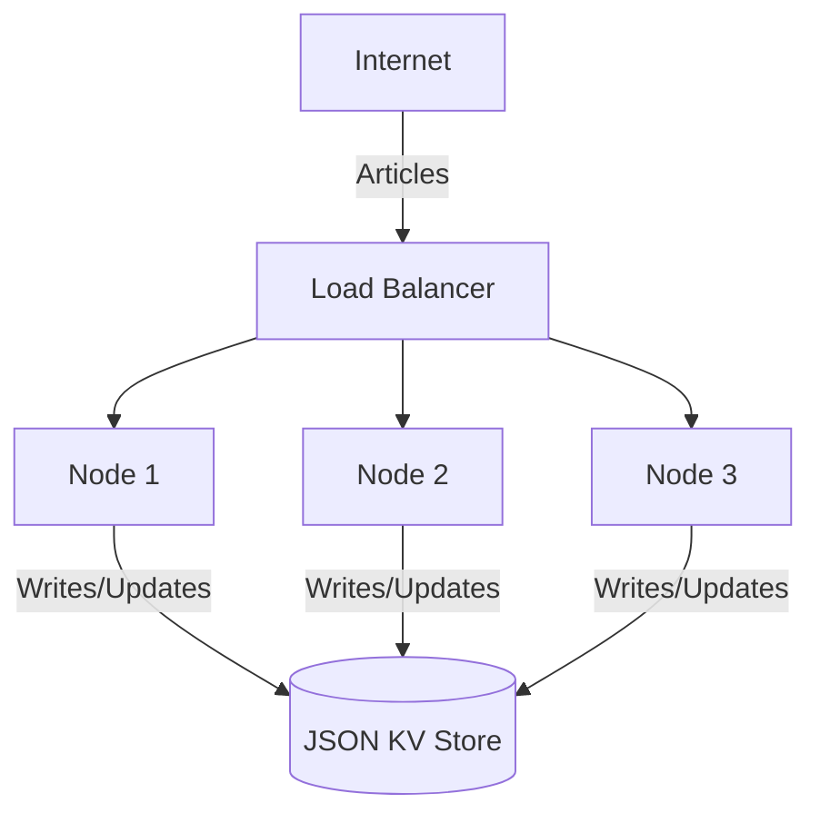
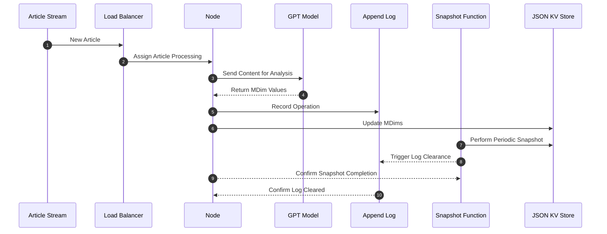

# Distributed Semantic Analysis/Monitoring System Design Document

## Table of Contents

- [Introduction](#introduction)
- [System Architecture](#system-architecture)
- [Node Design](#node-design)
- [Networking and Communication](#networking-and-communication)
- [Load Balancing Strategy](#load-balancing-strategy)
- [Storage and Log Management](#storage-and-log-management)
- [Metadata Extraction](#metadata-extraction)
- [API Endpoints](#api-endpoints)
- [Performance Benchmarking](#performance-benchmarking)
- [Future Considerations](#future-considerations)

## Introduction

The purpose of this document is to outline the design for a Distributed Semantic Analysis/Monitoring system, which analyzes public sentiment across various dimensions in articles related to specific topics over time. The system aims to demonstrate improved processing speed and efficiency by using a distributed approach compared to a synchronous single-node system.

## System Architecture



This diagram represents a high-level view of the system's architecture. The Load Balancer distributes incoming articles to nodes that process the data and write updates to their respective JSON KV Stores.

## Node Design
Each node is responsible for the following:

1. Creating a campaign with default MDims.
2. Processing articles by updating MDims based on mock metadata extraction results.
3. Storing processed state changes in both local append logs and the JSON KV Store.

## Networking and Communication
The system will use HTTP/REST for communication between nodes for its simplicity and ease of implementation. Each node will have a RESTful API that allows for creating campaigns, processing articles, and reading the current state of MDims.

## Load Balancing Strategy
The system will use a round-robin algorithm implemented within the Load Balancer to distribute incoming article processing requests evenly across available nodes.

## Storage and Log Management
The system will adopt simple JSON files as a key-value store for node state data, including campaign information and processed MDims. Each node will maintain an append-only log file to record operations, which will be compressed and snapshot periodically to update the JSON KV Store.


This sequence diagram shows the flow of article processing, logging, and snapshotting.

## Metadata Extraction
During the PoC phase, the metadata extraction will simply return random values between 0 and 1 for the MDims. For the full implementation, metadata extraction would involve analyzing the article content to obtain sentiment scores relevant to each MDim. The specifics of NLP integration will be explored post-PoC.

## API Endpoints
POST /createCampaign
Creates a new campaign with a given topic and default MDims.
Request Body: 
```json
{ "topic": "string" }
```
Response: 
```json
{ "campaignId": "string" }
```

POST /processArticle
Processes an article and updates MDims for the relevant campaign and date.
Request Body: 
```json
{ "campaignId": "string", "articleContent": "string", "publishedDate": "string" }
```
Response: 
```json
{ "success": boolean }
```

GET /readMDims
Returns the MDims for a given campaign and date.
Query Parameters: campaignId=string&date=string
Response: 
```json
{ "MDims": { "direction_quality": float, ... } }
```

## Performance Benchmarking
Performance benchmarking will be carried out using a custom-built tool to simulate article streaming and measure throughput across both the distributed system and a synchronous single-node reference configuration. The metrics collected will include articles processed per second, latency, and error rate.

## Future Considerations
Post-PoC, the system design will be revised to consider scaling, robust metadata extraction using NLP, real-time monitoring and alerting, data persistence scalability, and system resilience. The design will also incorporate user feedback and address performance bottlenecks identified during the PoC phase.

This concludes the detailed design document for the Distributed Semantic Analysis/Monitoring system. The document provides a template for team members to start implementation from scratch. The system outlined in this document should serve as a framework that is capable of evolving based on the requirements and feedback gathered during the PoC phase.

This design document is intended as a starting point. It covers key components required for distributed system design with performance in mind. As the PoC evolves, the design can be iterated on and adapted based on the findings and
