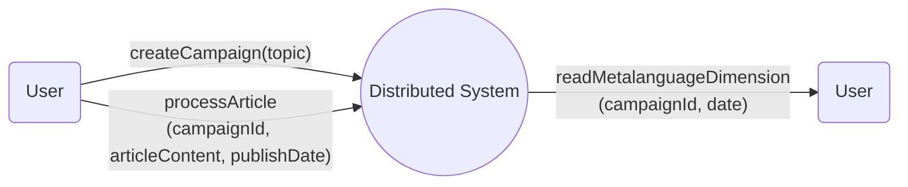
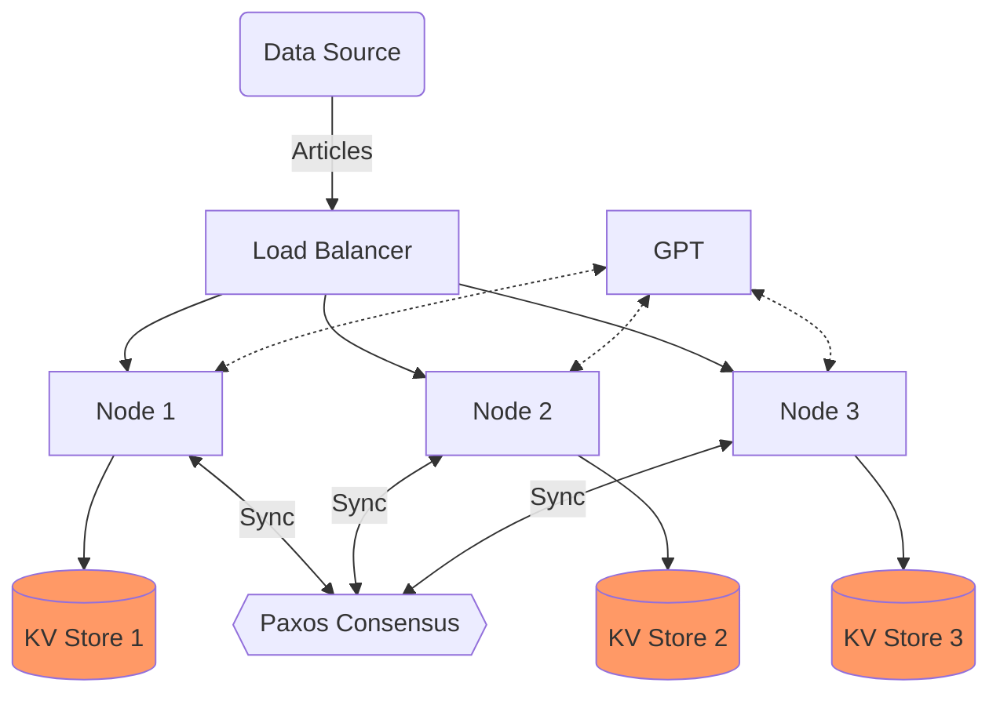
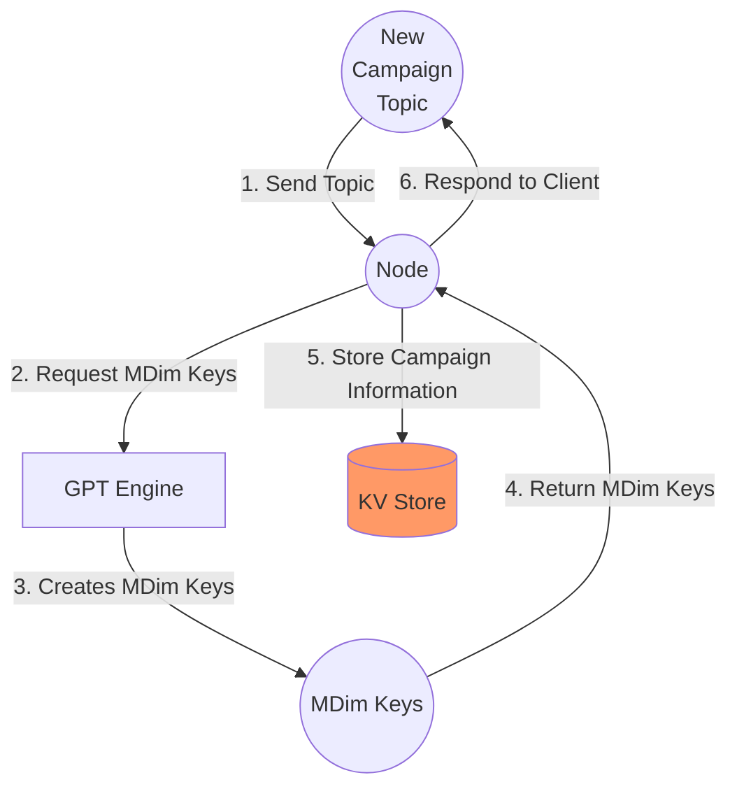
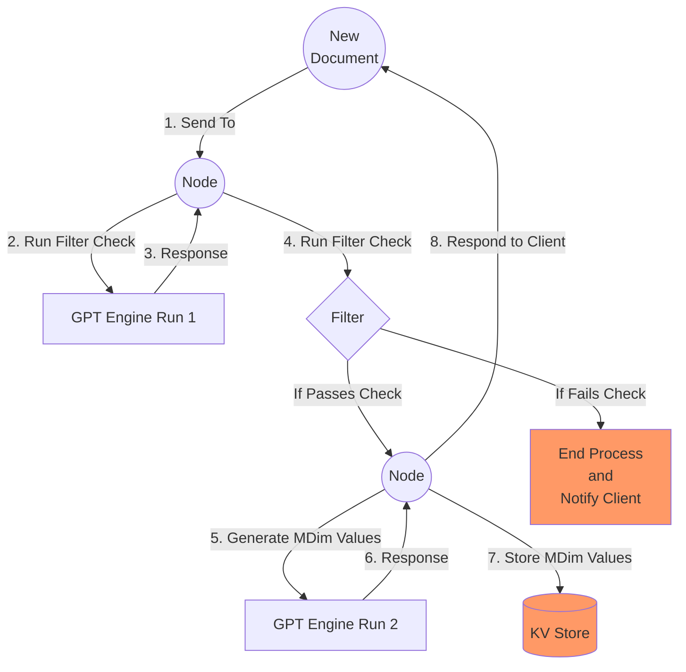
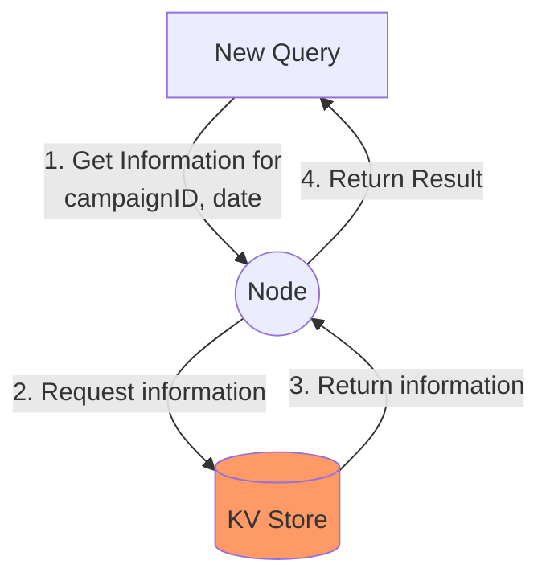
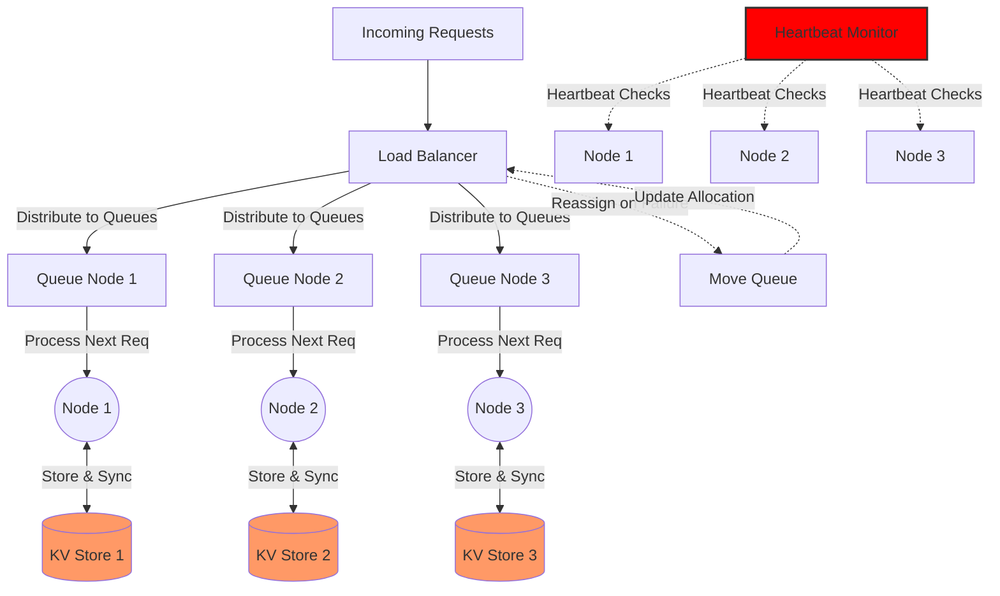
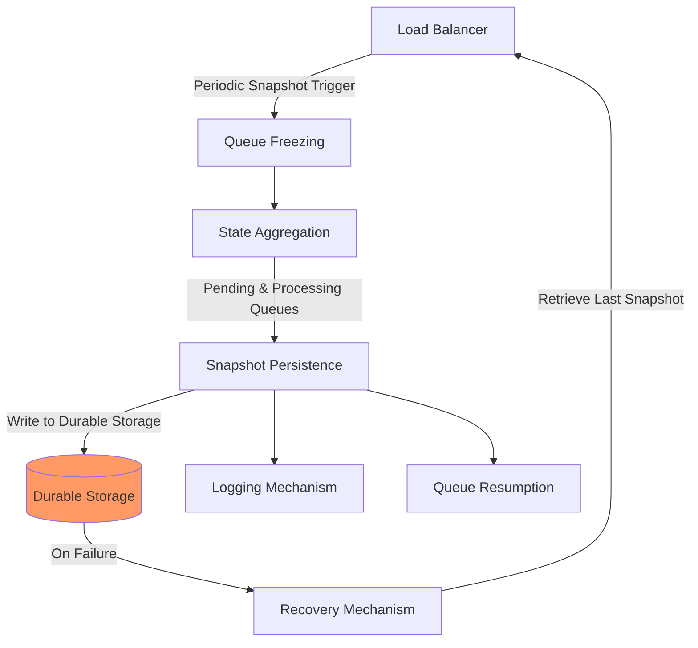
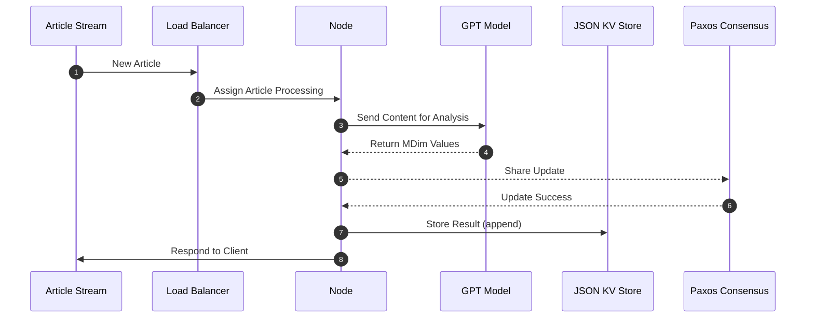

# Word Crunching: Distributed Semantic Analysis/Monitoring System Design Document

## Table of Contents

- [Introduction](#introduction)
- [System Architecture](#system-architecture)
- [Node Design](#node-design)
- [Networking and Communication](#networking-and-communication)
- [Load Balancing Strategy](#load-balancing-strategy)
- [Storage and Log Management](#storage-and-log-management)
- [Metadata Extraction](#metadata-extraction)
- [API Endpoints](#api-endpoints)
- [Performance Benchmarking](#performance-benchmarking)
- [Future Considerations](#future-considerations)
- [Story Point Estimation](#story-point-estimation)

## Introduction

If I were to ask you a question, "What is the public perception of company X through 2023?" and gave you a related set
of Articles, Social Media Posts, and YouTube video transcripts (published in 2023), how would we go about answering that
question?

### Naive Approach
In order to monitor a topic of interest, we need to observe information related to the topic across a few 
parameters or dimensions. If we are to stick
to the same example of company X, perhaps the following would be inferred from the articles in the form of a value 
between 0-1.

1. Overall User Satisfaction
2. Trust in X
3. Usability of X
4. Relevance of X
5. Future Outlook of X

If we can obtain values between 0-1 for these **Metalanguage Dimensions** for our articles published in 2023, we could
sufficiently answer the question. The information may also be used to obtain plots of data.

This analysis would traditionally happen via a manual review and labelling of articles, but it can also be done via 
sentiment analysis algorithms.

Today, we can use a tool like GPT to analyse any form of text content. The naive approach would involve sequentially 
retrieving the Metalanguage Dimension values and coming up with answer based on the values obtained.


## Background and Related Work
The paper titled "Extracting Knowledge from Wikipedia Articles through Distributed Semantic Analysis" [1] highlights the significance of semantic analysis in extracting meaning from language structures 
and discusses the challenges of using large-scale data. It introduces Distributed Semantic Analysis (DSA), a novel model that combines distributed computing with semantic analysis, addressing scalability issues. Most of the times, the scalability issues are solved by using distributed systems. Some of the ways in which distributed systems can help solve scalability challenges are as follows:


1. **Parallelism and Load Balancing:** Distributed systems enable parallel processing, where tasks are divided among 
   multiple nodes, allowing them to be executed simultaneously. This helps in distributing the workload and increasing overall system performance. Distributing the incoming workload evenly across multiple nodes ensures that no single node becomes a bottleneck. Load balancing algorithms help in optimizing resource utilization and maintaining system responsiveness.
2. **Data Partitioning:** Distributing data across multiple nodes prevents any single node from becoming a bottleneck 
   for data access. Various partitioning strategies, such as sharding, help in dividing the data into smaller subsets. Physically partitioning and distributing the Web across millions of servers enables efficient handling of a vast number of documents, contributing to the scalability of the World Wide Web [2].
3. **Data Replication:** Replicating data across multiple nodes ensures fault tolerance and improved read performance. 
   This way, if one node fails, the data can still be accessed from other replicas. Improves system availability, balances the load between components, and enhances overall performance [2].
4. **Caching:** Caching frequently accessed data in distributed systems can significantly reduce the load on the 
   backend servers. Caching results in making a copy of a resource, generally in the proximity of the client accessing that resource [2].
5. **Fault Tolerance:** Distributed systems often incorporate redundancy and replication to ensure fault tolerance. If 
a node fails, another node can take over its responsibilities, minimizing the impact on the overall system.

The solution of paper titled "Beyond Traditional NLP: A Distributed Solution for Optimizing Chat Processing" [3] is based on the Replicated Worker Paradigm, utilizing dynamically created tasks 
during the execution of the master/coordinator process. Replicated workers, identical on each machine and assigned to separate physical processors, enable parallel decomposition of processing operations, enhancing fault tolerance. The architecture includes distributed work pools controlling task allocation to workers, with each work pool representing a collection of tasks awaiting execution by a single worker. Workers register to the master, await task assignments, and, upon completion, send results back to the master while retrieving new tasks from their work pools. The master signals worker termination after completing all tasks in the input folder. Communication relies on message queues for an event-driven approach, utilizing Apache's ActiveMQ message broker. Load balancing is ensured by the master assigning new tasks to workers as they become available, following a First Come First Served (FCFS) strategy. The solution is optimized not only for distributed computation but also for continuous monitoring and task resubmission in case of failure, contributing to a best-effort approach in chat processing tasks.

These papers were written before GPT was made widely available and therefore we see the potential for extension in 
this domain. The papers referenced primarily use word pairings in their analysis, but in our proposal, sentiments of 
whole documents will be processed and analyzed.

Taking inspirations from these papers, we are designing our distributed system with the help of load balancing and 
paxos. The primary objective is to demonstrate improved processing speed and increased fault tolerance compared to a 
synchronous single-node system. Our system introduces a novel approach to campaign creation, article processing, and result retrieval. By leveraging distributed nodes and a robust key-value store synchronized through the Paxos consensus mechanism, we aim to provide users with a highly efficient and resilient tool for analyzing a myriad of topics with ease.

### Our Proposal
We propose a Distributed System that is able to process a large set of articles to answer questions that would
traditionally require a large number of human operators labelling articles manually in order to produce an answer. The
system aims to demonstrate improved processing speed and increased fault tolerance by using a distributed approach compared to a
synchronous single-node system. This design document outlines the design for this Distributed System.

#### Goals and Motivations

1. Increased Fault tolerance
2. Increased Processing Speeds

Compared to traditional, synchronous systems (1 node).

## High Level Interface

#### Description
The user is able to take 3 different actions.

1. Campaign Creation
2. Article Processing
3. Read Results




## Main Components

| Components                       | Description                                                                                                                                                                       |
|----------------------------------|-----------------------------------------------------------------------------------------------------------------------------------------------------------------------------------|
| Client/User                      | Initiates requests to the Distributed System.                                                                                                                                     |
| Article <br/> /Document          | The document being analyzed in the Distributed System. Can be used interchangeably.                                                                  <br/>                        |
| Load Balancer                    | Connects Clients to a Node that is ready to consume Requests                                                                                                                      |
| Node                             | Handles campaigns creation, article processing, and read requests. Initiates Paxos Consensus to share new information with all the other nodes.                                   |
| Topic                            | Research question that Clients want to find answers to.                                                                                                                           |
| Campaign                         | An active topic that has been defined in the Distributed System. Each Campaign has an associated set of Metalanguage Dimensions.                                                  |
| Metalanguage Dimensions          | A set of parameters, that represents features that are being assessed about a document. each MDim is expressed as a value between 0-1 to indicate the strength of that dimension. |
| MDims Keys                       | Refers to the dimensions themselves and not the values.                                                                                                                           |
| MDims Values                     | Refers to the values for each key in the MDims Keys.                                                                                                                              |
| Filter                           | The process via which an article is determined to be related to a research topic or not.                                                                                          |
| KV Store                         | Where active campaigns are tracked and results of article processing is stored.                                                                                                   |
| Paxos Consensus Mechanism        | Orchestrates the synchronization of updates across nodes to ensure a consistent view of the KV Store.                                                                             |

#### Metalanguage Dimensions Example:

If we create a campaign with the topic: "What is the impression of Bitcoin in my documents?"

The MDims Keys may be the following:
```json
[
  "generalAttitudeTowardsBitcoin",
  "trustInBitcoin",
  "investmentPotential",
  "futureOutlookOfBitcoin",
  "usabilityOfBitcoin"
]
```

These MDim keys are automatically obtained via GPT when a campaign is created. When an article is processed the MDim 
Values are obtained via GPT as well.

#### Filters Example:

Not all documents that are processed for a given campaign may actually be related to the campaign topic. For example,
if my research topic was about Bitcoin and the document I pass is about Donald Trump, it is probably not related to 
the campaign, in which case, it should be rejected and the client should be notified.

The filter check also utilizes GPT. We define a system message such that the response is a fixed JSON which looks 
like this:
```json
{
  "isRelevant": true 
}
```
Note: the return would be false if the document was not related to the campaign.

## KV Store Schema
The following is the schema of the KV store that each Node maintains:
```json
{
  "Campaigns": {
    "<campaignId>": {
      "topic": "string",
      "creationDate": "string",
      "mDimsKeys": ["mdim1", "mdim2", ...],
    },
    ...
  },
  "Articles": {
    "<campaignId>": {
      "<articleId>": {
        "publishedDate": "string",
        "mDimsValues": {
          "mdim1": float, // Value between 0-1
          "mdim2": float,
          ...
        },
        "isRelevant": boolean // The result of the filter check.
      },
      ...
    }
  },
  "MDimValuesByDate": {
    "<campaignId>": {
      "<date>": {
        "<articleId>": {
          "mDimsValues": {
            "mdim1": float,
            "mdim2": float,
            ...
          }
        },
        ...
      }
    }
  }
}
```
The KV store is synced between nodes via a Paxos Consensus Mechanism. It is triggered when new campaigns are being 
created and when article processing results needs to be stored.

## Operations

### Campaign Creation

- **Purpose:** Each campaign defines the set of metalanguage dimensions that articles will be assessed on. Each 
  campaign can be associated to 1 research question.
- **Inputs:**
    - topic: string
    - topic is the question that is being asked in natural language
- **Actions Taken:**
    -  **Generate MDim Keys to assess**
        - using GPT
    - **Generate Campaign ID:**
        - Generate a unique identifier (campaignId) for the new campaign.
    - **Initialize Campaign:**
        - Set up the new campaign in the KV Store with MDims Keys.
        - Use Paxos to sync campaign information (includes topic and MDim Keys) across 
          nodes

### Article Processing

- **Purpose:** To process an article based on the campaign it is being assessed for.
- **Inputs:**
    - campaignId: string
    - articleContent: string
    - publishDate: date
- **Actions:**
    - **Run Filter Check**
        - using GPT 
    -  **Generate MDim Values**
        - using GPT
    - **Store Result**
        - In KV Store
        - Use Paxos to sync across Nodes

### Reading Results

- **Purpose:** To query the system to retrieve results based on campaign and date
- **Inputs:**
    - campaignId: string
    - publishDate: date
- **Actions:**
    - Runs a round of Paxos Read
    - returns set of MDim calculations with article Ids for the date specified

## System Architecture



This diagram represents a high-level view of the system's architecture where each node has its own KV Store for
data storage. The Paxos consensus mechanism synchronizes the updates across the nodes as information is added to the 
system.

## Information Pipeline

### Stages of Creating a new Campaign 
 
The following diagram shows the steps that are taken when creating a new campaign in the system. We assume that the 
Load Balancer has assigned us a Node that will respond to requests.



### Stages of Document Processing
The following diagram shows the steps that are taken when processing a new document in the system. 
We assume that the Load Balancer has assigned us a Node that will respond to requests.

Note that the two nodes in the diagram refer to the same node. It is split up for readability.


### Stages of Querying Results
The following diagram shows the steps that are taken when a read request is issued in the system. 
We assume that the Load Balancer has assigned us a Node that will respond to requests.

To increase confidence in the results returned, we can run a round of Paxos Read. i.e query a set of nodes and take 
the union of the set of values. This would ensure that if there are nodes that are not fully up to date, they can 
receive the missed information from the other nodes. Note that the read speed would slow down in this case.

### Load Balancer
For all three user actions.

The Load Balancer is periodically snapshot and persisted such that on failure, we know where to pick up from again.  

## Node Design

Each node is capable of:

1. Creating a campaign by generating MDim Keys.
2. Processing articles by extracting MDim Values.
3. Handling consensus through Paxos to ensure each node's view of the JSON KV Store is consistent.
4. Reading values from its KV store to respond to queries.

## Paxos Consensus Process

There is a Paxos consensus process initiated for 2 out of 3 operations in our Distributed System. 

1. Campaign Creation: after generating the relevant MDim Keys for a topic, it needs to be shared across nodes in order 
   for all the nodes to independently be able to process articles for that campaignId.
2. Article Processing: after extracting the MDim values for an article, the results need to be shared across nodes 
   so any node is able to respond to queries about that article.

### Stages

1. Prepare (proposers --> acceptors)
    * Initiated on client `write` request
    * Send **All Nodes** `prepare` message with `seq_num`
2. Promise (acceptors --> proposers)
    * **All Nodes** `promise` with `success` or `fail` with `highest_seq_accepted`
    * Based on Quorum, proceeds to *Accept* if Quorum attained else, retry *Prepare* with `highest_seq_accepted + 1`
3. Accept (proposers --> acceptors)
    * When Quorum achieved for `sequence_number`, send `accept` message with `value` to append and `key` to append to.
    * 50% quorum for acceptance
4. Commitment (acceptors --> learners)
    * acceptors share learnings with **All Nodes**

### Paxos Lifecycle Diagram
Every node in our Distributed System will play all 3 roles of Proposer, Acceptor and Learner. 


## Networking and Communication

The system will use HTTP/REST for communication between nodes due to its simplicity and ease of implementation. Each
node will have a RESTful API that allows for creating campaigns, processing articles, and reading the current state of
MDims.

## Load Balancing Strategy

The system will use a round-robin algorithm implemented within the Load Balancer to distribute incoming article
processing requests evenly across available nodes. The Load Balancer will run periodic Heartbeat checks to all nodes 
to obtain status of nodes. If nodes do not respond, the process queue will be moved to a different active node.

### Load Balancer Snapshotting

In order to enhance fault tolerance and system resilience, particularly concerning the Load Balancer component, we introduce a Load Balancer Snapshotting mechanism. This mechanism is responsible for the periodic saving of the Load Balancer's state, which includes the queue statuses and any other relevant information. This persisted state will allow the Load Balancer to be accurately restored in case of a failure.

#### Snapshotting Strategy

The Load Balancer’s snapshotting feature is designed with the following key considerations:

1. **Snapshot Frequency:** The system will take periodic snapshots of the Load Balancer's state, including the current status of the queues (e.g., items waiting for processing, prospective items, etc.) and the corresponding metadata (like the timestamp, node allocations, etc.), at a frequency that balances performance and recovery requirements.

2. **Atomicity:** Each snapshot operation must be atomic to ensure either a full snapshot is saved or none at all, preventing partial or corrupt data snapshots.

3. **Concurrency Control:** Snapshot operations will be managed such that they do not interfere with the active routing of requests or the normal operation of the Load Balancer.

4. **Durability:** Snapshots will be persisted in a durable storage system that can survive system and network failures, ensuring that we can recover from Load Balancer failures swiftly.

5. **Snapshot Recovery:** On detecting a Load Balancer restart, the system will automatically retrieve the last saved snapshot and restore the Load Balancer to the most recent consistent state.

#### Snapshotting Process

The snapshotting process will involve the following stages:

1. **Queue Freezing:** Briefly suspend the Load Balancer's queue allocations to take a consistent snapshot.

2. **State Aggregation:** Collect the statuses of all processing and pending queues from the Load Balancer.

3. **Persistence:** Atomically write the collected state data into durable storage, noting the snapshot timestamp.

4. **Queue Resumption:** Resume the Load Balancer's normal operation, minimizing the pause's impact on request handling.

5. **Log Management:** Maintain logs detailing each snapshot operation to aid in problem diagnosis and system audits.

#### Failure Recovery

In the event of a Load Balancer failure, the system will:

1. Detect the failure and initiate the Load Balancer's restart mechanism.

2. Retrieve the last consistent snapshot of the Load Balancer state from durable storage.

3. Restore queue statuses and any other configurations from the snapshot to the Load Balancer.

4. Resume normal Load Balancer operations, redistributing requests to available nodes as per the restored state.

### Load Balancer Snapshot Diagram

To visualize the concept, below is a diagram illustrating the snapshotting process:



This diagram shows an example flow of the Load Balancer snapshotting process, from initiation to persistent storage and recovery mechanism.

By implementing Load Balancer Snapshotting, we enhance the robustness of our Distributed Semantic Analysis/Monitoring System, ensuring minimal downtime and faster recovery times in the event of Load Balancer failures.

## Storage and Log Management

The system will adopt simple JSON files as a key-value store for node state data, including campaign information and
processed MDims. Results of Article Processing is appended to the date in the KV store.



This sequence diagram illustrates the information flow from when a new article is queued to the MDims being stored 
in the KV store.

## GPT Usage

There are three parts to this:
- Filter Checks
- MDim Keys
- MDim Values

For all three, we will use the OpenAI API to generate the MDim Keys and MDim Values. The filter check will be a 
simple JSON response that responds with relevance. 

For example, if the research topic was: "What is the public perception of the new Martin Scorcese movie: Killers of 
the Flower Moon", the MDim Keys that GPT may generate is the following:

1. Film Direction Quality
2. Performance Quality
3. Set Design Quality
4. etc...

For each article we process in this campaign, we will need a value between 0-1 to describe the effectiveness of the 
movie to answer our original research question.

### Note on System Messages

For those unfamiliar with GPT, we are able to define a system message to GPT that will ensure it responds the way we 
expect it to. For example, during campaign creation, we will need to define a system message such that, when given a 
research topic, the return value from GPT is in a form we can process.

### System Message example
```
This is a question I want to answer from a set of articles:

<insert research topic here>

If I had an LLM trying to answer this question by providing a [-1, 1] range value across a few dimensions, what would those dimensions be?

For example:
if the question was “What is the overall impression of Donald Trump in my documents?”

the dimensions may be: [“satisfactionWithPresidency”, “confidenceInTrump”, “futureOutlook”]

Give me 5 in camelCase and as a JSON array
```

Similarly we can define a system message to take an article as input and return the set of MDim Values.

We also assume that each node has its own independent GPT worker for this design.


## API Endpoints
### POST /createCampaign
Creates a new campaign with a given topic and a set of MDims. 

Request Body:

```json
{
  "topic": "string"
}
```

Response:

```json
{
  "campaignId": "string"
}
```

Side-effects:
1. Store MDim Keys in KV Store
2. Sync across Nodes

### POST /processArticle
Processes an article and updates MDims for the relevant campaign and date. 

#### Request Body:

```json
{
  "campaignId": "string",
  "articleContent": "string",
  "publishedDate": "string"
}
```

#### Response:

```
{ "success": boolean }
```

#### Side-effects:
1. Store MDim Values in KV Store
2. Sync across Nodes


### GET /readMDims
Returns the MDims for a given campaign and date. 

#### Query Parameters: 
campaignId=string&date=string 

#### Response:

```
{ "MDims": [{ "articleId": string, mDims: {direction_quality": float, ...}}] }
```

# Read-Repair Based State Reconciliation

## Introduction

To ensure that each node has the most up-to-date information before handling any specific campaign or article-related actions, our system will implement a read-repair mechanism. When a node receives a request referencing a `campaignId` or `articleId`, it will query other nodes to verify whether it has the latest information. If it detects that it lacks certain updates, it will reconcile its state by fetching the missing data.

## Process Overview

### Step 1: Request Receipt and Initial Check

- When a node (`RequestingNode`) receives a request that involves a `campaignId` or `articleId`, it performs an initial check against its local KV Store.

### Step 2: Querying Other Nodes
- If the `campaignId` or `articleId` is unknown or if there is any indication that an update might be missing (e.g., inconsistency in related meta-information), the `RequestingNode` sends a query to a subset or all other nodes to check for the most recent state.
  
### Step 3: Fetching and Applying Missing Updates
- Based on responses from other nodes, the `RequestingNode` identifies if there are any updates it has missed.
- The `RequestingNode` fetches the missing data and applies it in the correct order to ensure a consistent state.

### Step 4: Execution or Forwarding of the Request
- Once the `RequestingNode` is confident that its state is up-to-date, it can proceed to execute the original request.
- If the request is read-related, and the node is still synchronizing, it may forward the read request to another node that has confirmed that it has the latest state.

### Step 5: Client Notification
- During this process, if there is any notable delay or failure, the `RequestingNode` should inform the client of the status, possibly suggesting a retry after some time.

By incorporating this read-repair based approach, nodes are reactive and self-healing, asking for the latest information only when necessary. This method reduces overhead, as full state synchronization is triggered by actual demand rather than at regular intervals or by detecting a global versioning discrepancy.

## Performance Benchmarking

Performance benchmarking will be carried out using a custom-built tool to simulate article streaming and measure
throughput across both the distributed system and a synchronous single-node reference configuration. The metrics
collected will include articles processed per second, latency, and error rate.

## Potential System Failures

1. **Node Failure:**
    - A node may fail during various stages, such as campaign creation, article processing, or the Paxos consensus
      process.

2. **Proposal Rejection:**
    - Proposals during the Paxos process may be rejected, leading to the need for the proposer to adapt and propose a
      new update.

3. **Network Partitions:**
    - Network partitions may occur, disrupting communication between nodes. Paxos is designed to tolerate partitions to
      some extent, but prolonged partitions may pose challenges.

4. **Duplicate Operations:**
    - Nodes must ensure that duplicate operations are not processed. This is critical during the Paxos consensus process
      and in handling article processing requests.

5. **Invalid Article Processing Request:**
    - The system needs to handle cases where an article processing request is invalid or contains incorrect parameters.

6. **OPENAI API Connection Failure:**
    - Failures in establishing a connection to the OPENAI API during the article processing phase could occur.

8. **Consensus Process Failure:**
    - Failures during the Paxos consensus process may prevent the synchronization of updates across nodes.

9. **Load Balancer Failure:**
    - Issues with the load balancer may impact the even distribution of article processing requests across nodes.

10. **JSON KV Store Failure:**
    - Failures in the JSON KV store, where state data is maintained, could lead to data inconsistencies.

11. **Campaign ID Generation Failure:**
    - Failure to generate a unique campaign ID during campaign creation could lead to conflicts.

12. **Unavailability of GPT:**
    - Single point of failure since the sentiment is calculated based on responses from the GPT. But we are assuming that each of the nodes will have their own custom GPT model with robust error handling.

12. **Article Content Extraction Failure:**
    - Errors in extracting MDims from the article content during the article processing phase.

## Future Considerations

Post-PoC, the system design will be revised to consider scaling, real-time
monitoring and alerting, data persistence scalability, and system resilience. The design will also incorporate user
feedback and address performance bottlenecks identified during the PoC phase.

The current design does not deal with nodes that lag behind on information. For example, if a node goes offline for 
a wihle and then comes back online, there is currently no mechanism to retrieve the missed updates. This would need 
to be looked at in the future.

## Conclusion

This detailed design document provides the foundation for implementing the Distributed Semantic Analysis/Monitoring
system from scratch. It outlines the architecture, components, and processes necessary for a PoC that can be scaled and
enhanced based on future requirements and findings.

Moreover, this design can be made more generic to perform a wider variety of actions across large natural language 
datasets. 

## References
[1] Nguyen Trung Hieu, Mario Di Francesco, and Antti Ylä-Jääski. 2013. Extracting Knowledge from Wikipedia Articles through Distributed Semantic Analysis. In Proceedings of the 13th International Conference on Knowledge Management and Knowledge Technologies (i-Know '13). Association for Computing Machinery, New York, NY, USA, Article 6, 1–8. https://doi.org/10.1145/2494188.2494195

[2] van Steen, M., Tanenbaum, A.S. A brief introduction to distributed systems. Computing 98, 967–1009 (2016). https://doi.org/10.1007/s00607-016-0508-7

[3] Dascalu, Mihai & Dobre, Ciprian & Trausan-Matu, Stefan & Cristea, Valentin. (2011). Beyond Traditional NLP: A Distributed Solution for Optimizing Chat Processing - Automatic Chat Assessment Using Tagged Latent Semantic Analysis. Proceedings - 2011 10th International Symposium on Parallel and Distributed Computing, ISPDC 2011. 133-138. 10.1109/ISPDC.2011.28. 