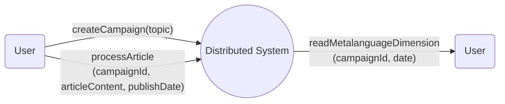
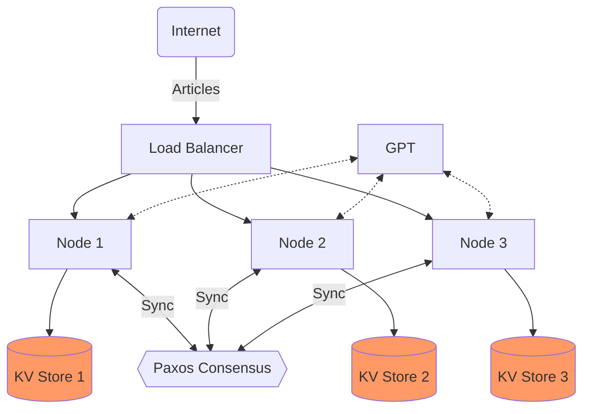
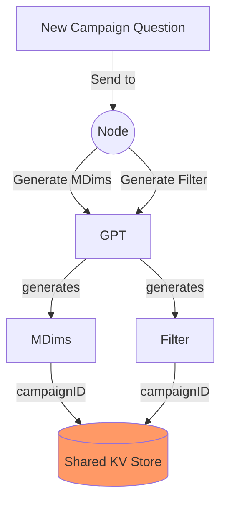
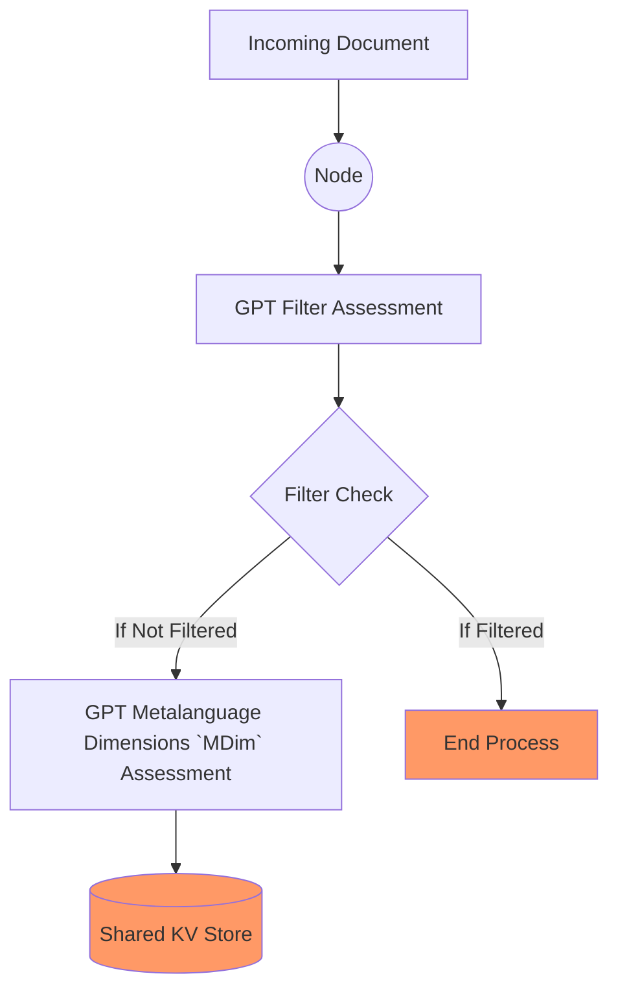
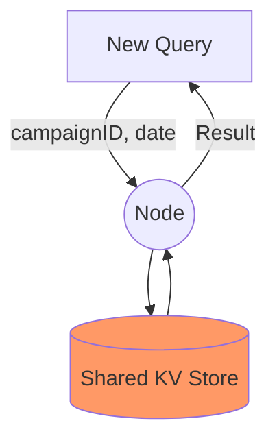
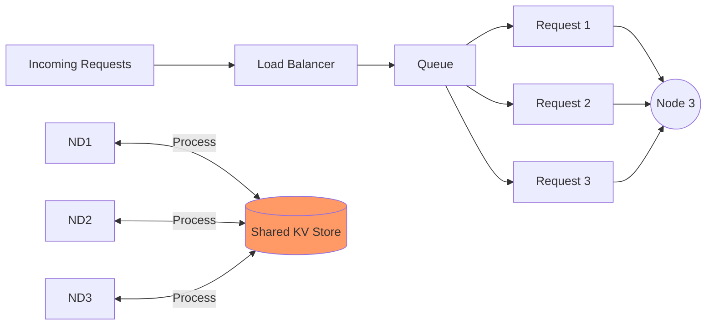
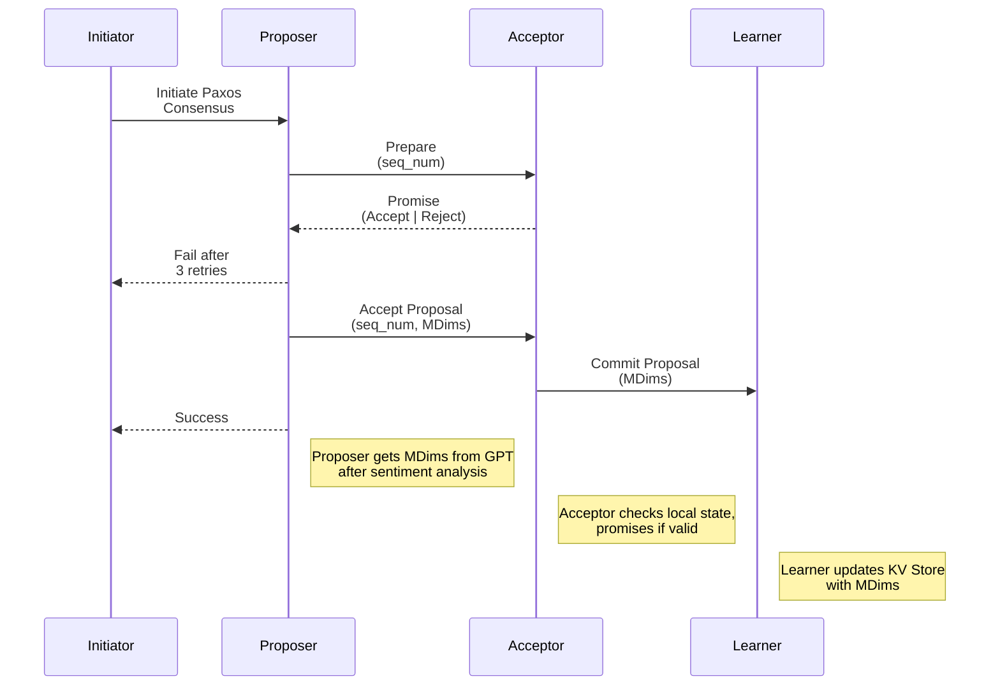
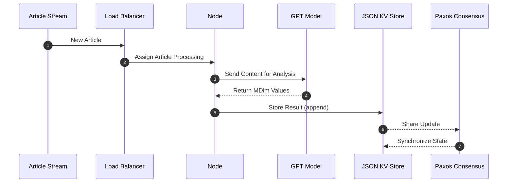

# Word Crunching: Distributed Semantic Analysis/Monitoring System Design Document

## Table of Contents

- [Introduction](#introduction)
- [System Architecture](#system-architecture)
- [Node Design](#node-design)
- [Networking and Communication](#networking-and-communication)
- [Load Balancing Strategy](#load-balancing-strategy)
- [Storage and Log Management](#storage-and-log-management)
- [Metadata Extraction](#metadata-extraction)
- [API Endpoints](#api-endpoints)
- [Performance Benchmarking](#performance-benchmarking)
- [Future Considerations](#future-considerations)
- [Story Point Estimation](#story-point-estimation)

## Introduction

If I were to ask you a question, "What is the public perception of company X through 2023?" and gave you a related set
of Articles, Social Media Posts, and YouTube video transcripts (published in 2023), how would we go about answering that
question?

### Naive Approach
In order to monitor a subject, we need to observe the subject across a few parameters or dimensions. If we are to stick
to the same example of company X, perhaps the following would be inferred from the articles: [value between 0-1]

1. Overall User Satisfaction
2. Trust in X
3. Usability of X
4. Relevance of X
5. Future Outlook of X

If we can obtain values between 0-1 for these **Metalanguage Dimensions** for our articles published in 2023, we could
sufficiently answer the question we sought to answer. The information may also be used to obtain plots of data.

This analysis would traditionally happen via a manual review and labelling of articles, but it can also be done via 
sentiment analysis algorithms.

Today, we can use a tool like GPT to analyse any form of text content. The naive approach would involve sequentially 
retrieving the Metalanguage Dimension values and coming up with answer based on the values obtained.

### Our Proposal
We propose a Distributed System that is able to process a large set of articles to answer questions that would
traditionally require a large number of human operators labelling articles manually in order to produce an answer. The
system aims to demonstrate improved processing speed and efficiency by using a distributed approach compared to a
synchronous single-node system.

This design document outlines the design for a Distributed Semantic Analysis/Monitoring system,
which analyzes public sentiment across various dimensions in articles related to specific topics over time. The system
aims to demonstrate improved processing speed and efficiency by using a distributed approach compared to a synchronous
single-node system.

## High Level Interface


## Main Components

| Components                | Description                                                                                                                                                                                                                         |
|---------------------------|-------------------------------------------------------------------------------------------------------------------------------------------------------------------------------------------------------------------------------------|
| Node                      | Responsible for creating campaigns, processing articles, and handling consensus through the Paxos mechanism.       Maintains a JSON KV Store for state data.                                                                        |
| Paxos Consensus Mechanism | Orchestrates the synchronization of updates across nodes to ensure a consistent view of the JSON KV Store.        Involves various phases.                                                                                          |
| Load Balancer             | Distributes incoming article processing requests evenly across available nodes using a round-robin algorithm.                                                                                                                       |
| JSON KV Store             | Stores node state data, including campaign information and processed MDims.                                       Maintains an append-only log file for operations, periodically compressed and snapshot for updates.               |
| Metalanguage Extraction   | Full implementation involves analyzing article content to obtain sentiment scores relevant to each MDim.                                                                                                                            |
| HTTP/REST Communication   | Nodes communicate using HTTP/REST for simplicity and ease of implementation.                                       Each node has a RESTful API supporting endpoints for creating campaigns, processing articles, and reading MDims. |
| Client                    | Initiates requests for processing articles or creating campaigns                                                                                                                                                                    |

## Properties

1. Updates to MDims for sentiment analysis are consistent across nodes, providing a unified view.
2. MDims are stored in an append-only mode, maintaining a historical record of sentiment changes.
3. Redundant updates are avoided; the system compares MDims to ensure the sentiment of an article is updated only once
   for a specific date.
4. Filter process will assess articles for relevance to topic, only article processing if filter check passes.

## Operations

### Campaign Creation

- **Purpose:** Each campaign defines the set of metalanguage dimensions that articles will be assessed on. Each 
  campaign can be associated to 1 research question.
- **Inputs:**
    - topic: string
    - topic is the question that is being asked in natural language
- **Actions:**
    -  **Generate Metalanguage Dimensions to assess**
        - using GPT
    -  **Generate Filter Dimensions to assess**
        - using GPT
    - **Generate Campaign ID:**
        - Generate a unique identifier (campaignId) for the new campaign.
    - **Initialize Campaign:**
        - Set up the new campaign in the JSON KV Store with MDims and Filter information.
        - Use Paxos to sync campaign information (includes topic, Metalanguage Dimensions and Filter Dimensions) across 
          nodes

### Article Processing

- **Purpose:** To process an article based on the campaign it is being assessed for.
- **Inputs:**
    - campaignId: string
    - articleContent: string
    - publishDate: date
- **Actions:**
    - Initiates connection to the OPENAI API.
    - Runs article through filter to assess relevance.
    - Extract MDims from the article content if filter check passes.
    - Sync results across nodes

### Reading Results

- **Purpose:** To query the system to retrieve results based on campaign and date
- **Inputs:**
    - campaignId: string
    - publishDate: date
- **Actions:**
    - Runs a round of Paxos read
    - returns set of MDim calculations with article Ids for the date specified

Finally, the state machine diagram is shown below:

## System Architecture



This diagram represents a high-level view of the system's architecture where each node has its own JSON KV Store for
state data. The Paxos consensus mechanism synchronizes the updates across the nodes.

## Information Pipeline

### Stages of Creating a new Campaign 


### Stages of Document Processing


### Stages of Querying Results


### Load Balancer
For all three user actions


## Node Design

Each node is capable of:

1. Creating a campaign by generating MDims.
2. Processing articles by extracting MDim values.
3. Handling consensus through Paxos to ensure each node's view of the JSON KV Store is consistent.
4. Reading values from its KV store to respond to queries.

## Paxos Consensus Process

There is a Paxos consensus process initiated for 2 out of 3 operations in our Distributed System. 

1. Campaign Creation: after generating the relevant MDims for a topic, it needs to be shared across nodes in order 
   for all the nodes to independently be able to process articles.
2. Article Processing: after extracting the MDim values for an article, the results need to be shared across nodes 
   so any node is able to respond to queries

### Stages

1. Prepare (proposers --> acceptors)
    * Initiated on client `write` request
    * Send **All Nodes** `prepare` message with `seq_num`
2. Promise (acceptors --> proposers)
    * **All Nodes** `promise` with `success` or `fail` with `highest_seq_accepted`
    * Based on Quorum, proceeds to *Accept* if Quorum attained else, retry *Prepare* with `highest_seq_accepted + 1`
3. Accept (proposers --> acceptors)
    * When Quorum achieved for `sequence_number`, send `accept` message with `value` to append and `key` to append to.
    * 50% quorum for acceptance
4. Commitment (acceptors --> learners)
    * acceptors share learnings with **All Nodes**

#### Lifecycle Diagram



### Handling Failures

* Node Failure
    * If a node fails during the consensus process, the client should be notified of failure so they may try again

* Proposal Rejection
    * If a proposal is rejected during the Prepare or Accept phases, the proposer must attempt to reach 3 attempts 
      before failure

* Network Partitions
    * Paxos is designed to tolerate network partitions to a certain extent. However, prolonged partitions may require
      additional mechanisms for reconciliation.

## Networking and Communication

The system will use HTTP/REST for communication between nodes due to its simplicity and ease of implementation. Each
node will have a RESTful API that allows for creating campaigns, processing articles, and reading the current state of
MDims.

## Load Balancing Strategy

The system will use a round-robin algorithm implemented within the Load Balancer to distribute incoming article
processing requests evenly across available nodes.

## Storage and Log Management

The system will adopt simple JSON files as a key-value store for node state data, including campaign information and
processed MDims. Results of Article Processing is appended to the date in the KV store.



This sequence diagram illustrates the information flow from when a new article is queued to the MDims being stored 
in the KV store.

## Metalanguage and Filter Dimensions Generation and Extraction

There are two parts to this:
- Figuring out the Metalanguage and Filter Dimensions for a topic of interest
- Figuring out the values for a set of Metalanguage or Filter dimensions given an article and a research topic

For both of these, we will use the OpenAI API to generate the metalanguage and filter dimensions and to extract the 
values for those dimensions from an article. 

For example, if the research topic was: "What is the public perception of the new Martin Scorcese movie: Killers of 
the Flower Moon", the Metalanguage dimensions to analyze may be: 

1. Film Direction Quality
2. Performance Quality
3. Set Design Quality
4. etc...

and the filter dimensions may be:

1. Relevance to Martin Scorcese
2. Relevance to Killers of the Flower Moon
3. Relevance to Movie

For each article we process in this campaign, we will need a value between 0-1 to describe the effectiveness of the 
movie to answer our original research question.

For the filter, we will define threshold values for each filter value. In order for an article to be processed for a 
campaignId, we will need to pass the filter check. It can only be passed if the article is assessed for the filters 
and all the values obtained from GPT are higher than the filter values, thereby not processing an article for a 
campaign if the contents are unrelated to the topic in question.

## API Endpoints
### POST /createCampaign
Creates a new campaign with a given topic and a set of MDims. Request Body:

```json
{
  "topic": "string"
}
```

Response:

```json
{
  "campaignId": "string",
  "mDimsToAnalyse": ["mdim1", "mdim2"],
  "filterDims": {"filter1":  float (threshold between 0-1), ...}
}
```

### POST /processArticle
Processes an article and updates MDims for the relevant campaign and date. Request Body:

```json
{
  "campaignId": "string",
  "articleContent": "string",
  "publishedDate": "string"
}
```

Response:

```
{ "success": boolean, "processedMDims": { "mdim1": float, ... } }
```

GET /readMDims
Returns the MDims for a given campaign and date. Query Parameters: campaignId=string&date=string Response:

```
{ "MDims": [{ "articleId": string, mDims: {direction_quality": float, ...}}] }
```

## Performance Benchmarking

Performance benchmarking will be carried out using a custom-built tool to simulate article streaming and measure
throughput across both the distributed system and a synchronous single-node reference configuration. The metrics
collected will include articles processed per second, latency, and error rate.

## Potential System Failures

1. **Node Failure:**
    - A node may fail during various stages, such as campaign creation, article processing, or the Paxos consensus
      process.

2. **Proposal Rejection:**
    - Proposals during the Paxos process may be rejected, leading to the need for the proposer to adapt and propose a
      new update.

3. **Network Partitions:**
    - Network partitions may occur, disrupting communication between nodes. Paxos is designed to tolerate partitions to
      some extent, but prolonged partitions may pose challenges.

4. **Duplicate Operations:**
    - Nodes must ensure that duplicate operations are not processed. This is critical during the Paxos consensus process
      and in handling article processing requests.

5. **Invalid Article Processing Request:**
    - The system needs to handle cases where an article processing request is invalid or contains incorrect parameters.

6. **OPENAI API Connection Failure:**
    - Failures in establishing a connection to the OPENAI API during the article processing phase could occur.

7. **MDim Retrieval Failure:**
    - Issues in retrieving MDims or counting processed values for a specified date may lead to failures in the
      aggregation process.

8. **Consensus Process Failure:**
    - Failures during the Paxos consensus process may prevent the synchronization of updates across nodes.

9. **Load Balancer Failure:**
    - Issues with the load balancer may impact the even distribution of article processing requests across nodes.

10. **JSON KV Store Failure:**
    - Failures in the JSON KV store, where state data is maintained, could lead to data inconsistencies.

11. **Campaign ID Generation Failure:**
    - Failure to generate a unique campaign ID during campaign creation could lead to conflicts.

12. **Article Content Extraction Failure:**
    - Errors in extracting MDims from the article content during the article processing phase.

## Future Considerations

Post-PoC, the system design will be revised to consider scaling, real-time
monitoring and alerting, data persistence scalability, and system resilience. The design will also incorporate user
feedback and address performance bottlenecks identified during the PoC phase.

## Conclusion

This detailed design document provides the foundation for implementing the Distributed Semantic Analysis/Monitoring
system from scratch. It outlines the architecture, components, and processes necessary for a PoC that can be scaled and
enhanced based on future requirements and findings.

Moreover, this design can be made more generic to perform a wider variety of actions across large natural language 
datasets. 