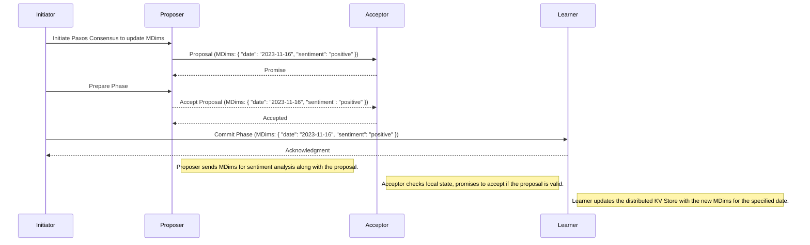

# Distributed Semantic Analysis/Monitoring System Design Document

## Table of Contents

- [Introduction](#introduction)
- [System Architecture](#system-architecture)
- [Node Design](#node-design)
- [Networking and Communication](#networking-and-communication)
- [Load Balancing Strategy](#load-balancing-strategy)
- [Storage and Log Management](#storage-and-log-management)
- [Metadata Extraction](#metadata-extraction)
- [API Endpoints](#api-endpoints)
- [Performance Benchmarking](#performance-benchmarking)
- [Future Considerations](#future-considerations)
- [Story Point Estimation](#story-point-estimation)

## Introduction

The purpose of this document is to outline the design for a Distributed Semantic Analysis/Monitoring system, which analyzes public sentiment across various dimensions in articles related to specific topics over time. The system aims to demonstrate improved processing speed and efficiency by using a distributed approach compared to a synchronous single-node system.

## System Architecture


This diagram represents a high-level view of the system's architecture where each node has its own JSON KV Store for state data. The Paxos consensus mechanism synchronizes the updates across the nodes.

## Node Design
Each node is responsible for:

1. Creating a campaign with default MDims.
2. Processing articles by extracting MDims and aggregating these into the existing values.
3. Handling consensus through Paxos to ensure each node's view of the JSON KV Store is consistent.
4. Aggregated MDim Calculation

### When a new MDim value is processed, the node will:

Retrieve the current MDim value and the count of processed values for the date.
Aggregate the new value using the formula: 


Update the MDim value and increment the processed count.
Share this processed information with other nodes during the Paxos consensus stage.

## Paxos Consensus Process
Initiation:
The Paxos consensus process is initiated when there's a need to update MDims for sentiment analysis. This occurs, for example, during the processing of an article.

Proposal Phase:
The node that initiates the consensus process (the proposer) sends a proposal to all nodes. The proposal includes the updated MDims for a specific date related to the sentiment of the article.

Prepare Phase:
Nodes receiving the proposal respond with a "prepare" message, indicating their readiness to accept the proposed update.
Each node checks its local state to ensure it has the latest information about the specified article and date.

Promise Phase:
If a node receives a "prepare" message and determines that the proposed update is valid, it responds with a "promise" message. This message includes information about its current state and whether it has accepted any other proposals for the same article and date.

Acceptance Condition:
For a proposal to be accepted, a node must receive promises from a majority of nodes in the system.

Accept Phase:
If the proposer receives promises from a majority of nodes, it sends an "accept" message to all nodes.
Nodes, upon receiving the "accept" message, update their local state with the proposed MDims and respond with an acknowledgment.

Commitment Phase:
Once the proposer receives acknowledgments from a majority of nodes, it sends a "commit" message to finalize the update in the distributed JSON KV Store.
Nodes, upon receiving the "commit" message, append the new MDims to the existing ones for the specified article and date.

Handling Failures:
Node Failure:
If a node fails during the Paxos process, the system should be designed to detect and recover from failures.
The Paxos process can be restarted with a new proposer.

Proposal Rejection:
If a proposal is rejected during the Prepare or Accept phases, the proposer must adapt and propose a new update.

Network Partitions:
Paxos is designed to tolerate network partitions to a certain extent. However, prolonged partitions may require additional mechanisms for reconciliation.

Integration with System States:
Consensus Handling State:
The Paxos consensus process is initiated within the "Consensus Handling" state of the system, specific to updating MDims for sentiment analysis.

Transitions:
Transitions to other states (e.g., Article Processing) depend on the outcomes of the Paxos consensus process.

Advantages and Considerations:
Sentiment Analysis Integration:
Paxos ensures that updates to MDims for sentiment analysis are consistent across nodes, providing a unified view.

MDim Writing in Append-Only Mode:
The MDims are appended in an append-only mode in the distributed JSON KV Store, maintaining a historical record of sentiment changes.

Comparing MDims:
The system compares MDims of the same article for the same date to avoid redundant updates, ensuring that the sentiment of an article is updated only once for a specific date.




## Networking and Communication
The system will use HTTP/REST for communication between nodes due to its simplicity and ease of implementation. Each node will have a RESTful API that allows for creating campaigns, processing articles, and reading the current state of MDims.

## Load Balancing Strategy
The system will use a round-robin algorithm implemented within the Load Balancer to distribute incoming article processing requests evenly across available nodes.

## Storage and Log Management
The system will adopt simple JSON files as a key-value store for node state data, including campaign information and processed MDims. Each node will maintain an append-only log file to record operations, which will be compressed and snapshot periodically to update the JSON KV Store.


This sequence diagram elaborates on the storage management and synchronization process involving Paxos consensus.

## Metadata Extraction
During the PoC phase, the metadata extraction will simply return random values between 0 and 1 for the MDims. For full implementation, metadata extraction would involve analyzing the article content to obtain sentiment scores relevant to each MDim. The specifics of NLP integration will be explored post-PoC.

## API Endpoints
POST /createCampaign
Creates a new campaign with a given topic and default MDims. Request Body:

```json
{ "topic": "string" }
```
Response:

```json
{ "campaignId": "string" }
```
POST /processArticle
Processes an article and updates MDims for the relevant campaign and date. Request Body:

```json
{ "campaignId": "string", "articleContent": "string", "publishedDate": "string" }
```
Response:

```
{ "success": boolean, "newMDims": { "mdim1": float, ... } }
```
GET /readMDims
Returns the MDims for a given campaign and date. Query Parameters: campaignId=string&date=string Response:

```
{ "MDims": { "direction_quality": float, ... } }
```

## Performance Benchmarking
Performance benchmarking will be carried out using a custom-built tool to simulate article streaming and measure throughput across both the distributed system and a synchronous single-node reference configuration. The metrics collected will include articles processed per second, latency, and error rate.

## Future Considerations
Post-PoC, the system design will be revised to consider scaling, robust metadata extraction using NLP, real-time monitoring and alerting, data persistence scalability, and system resilience. The design will also incorporate user feedback and address performance bottlenecks identified during the PoC phase.

## Story Point Estimation
| Task                         | Description                                                                                      | Estimated Points |
|------------------------------|--------------------------------------------------------------------------------------------------|------------------|
| System Architecture          | Overall design, including node architecture and data flow diagrams.                              | 5                |
| Node Design                  | Define the responsibilities, functionalities, and state management of an individual node.        | 3                |
| Networking and Communication | Specify communication protocols and mechanisms for data exchange between nodes.                  | 3                |
| Load Balancing Strategy      | Develop the algorithm or strategy for distributing workloads across nodes.                       | 2                |
| Storage and Log Management   | Design the JSON KV store, log file functioning, and snapshotting mechanism.                      | 3                |
| Metadata Extraction          | Plan a simplified approach for MDims extraction and propose a mock implementation for the PoC.   | 2                |
| API Endpoints                | Detail each API endpoint, including expected inputs, outputs, and error handling.                | 3                |
| Performance Benchmarking     | Formulate a plan for how to benchmark the system and analyze its performance.                    | 5                |
| Future Considerations        | Outline potential enhancements, scalability options, and other considerations for post-PoC.     | 1                |
| Overall Documentation        | Writing, formatting the document, and creating diagrams.                                        | 8                |

## Conclusion
This detailed design document provides the foundation for implementing the Distributed Semantic Analysis/Monitoring system from scratch. It outlines the architecture, components, and processes necessary for a PoC that can be scaled and enhanced based on future requirements and findings.
