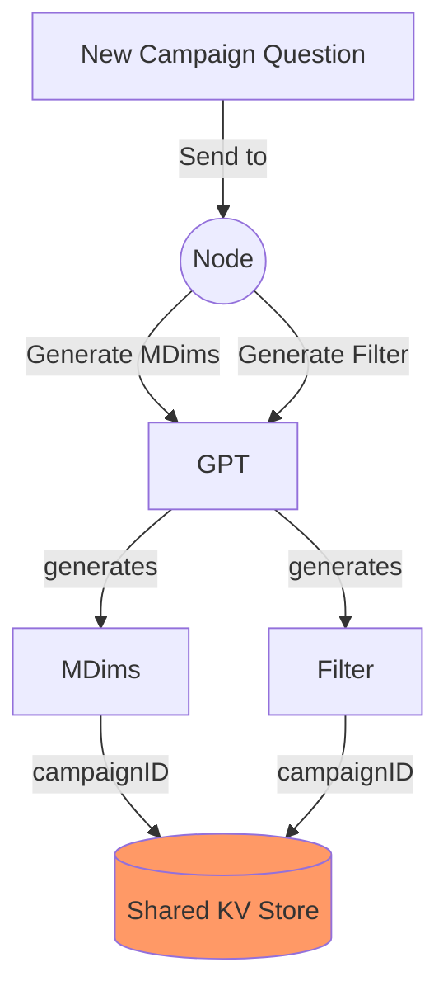
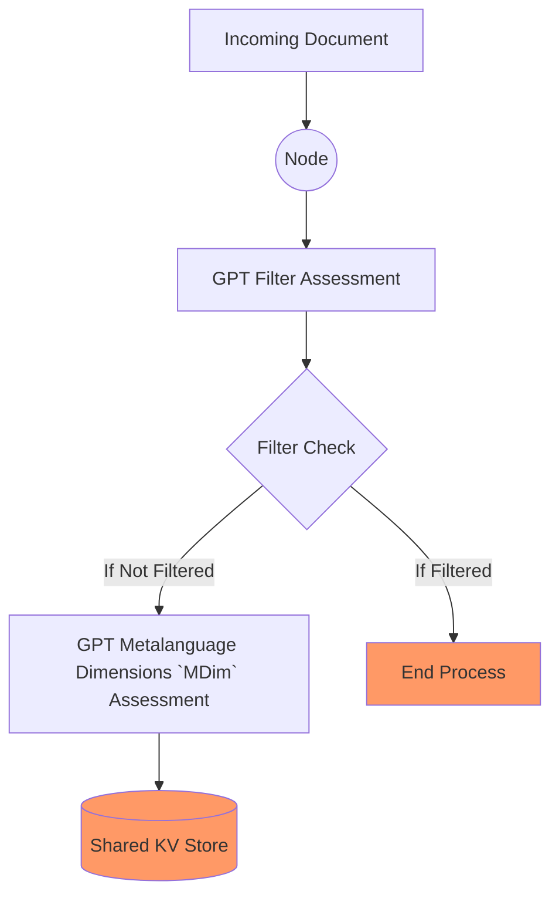
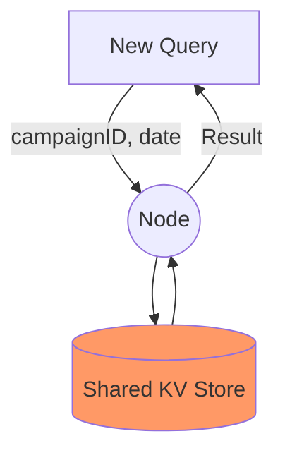
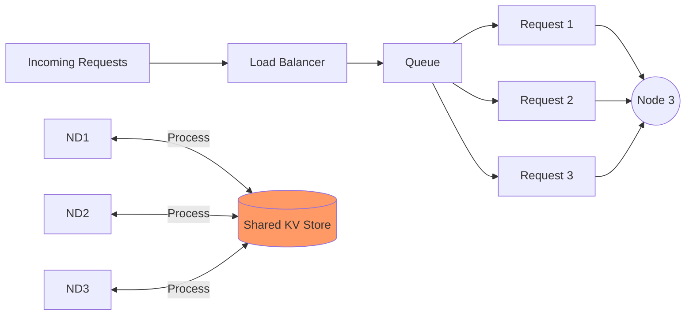

# Distributed Semantic Analysis/Monitoring System Prototype Design Document

The purpose of this document is to outline the design for the prototype we are building to illustrate the speed improvements that results from
the Distributed Semantic Analysis/Monitoring System.

## Prototype Goals

1. Should be able to create a new Campaign with a topic of interest
    1. Example: "How are people liking the new Martin Scorcese movie: Killers of the Flower Moon"
2. Should accept a Document and a CampaignID as an input to queue for processing
3. Should be able to query the results based on CampaignID and a date

## Some Prototype Simplifications
In the interest of time, we will be making some simplifications to our complete design to implement the prototype.

1. Shared KV store
   1. No paxos consensus
2. Concurrency library will be used

## Information Pipeline

### Stages of Creating a new Campaign 

### Stages of Document Processing

### Stages of Querying Results

### Load Balancer
For all three user actions

## Notes
 